# HEATGUARD — Derivativos Climáticos para Hedge de Produtividade da Soja

HEAT (calor, CDD) + GUARD (proteção). Modelagem, precificação, **backtest
walk-forward** e hedge com **opções CDD** (*Cooling Degree Days*) sobre a
produtividade da soja em 3 regiões do Brasil.

Projeto submetido ao **Desafio Quant AI** — apresentação de 5 slides (16:9),
pipeline completo de dados à precificação, com backtesting histórico.

---

<p align="center">
  
</p>

## Resultados Principais

| Região | Efetiv. BT | Efetiv. MC | Prêmio | K ótimo | R² prod. | σ OU |
|--------|-----------|-----------|--------|---------|-----------|------|
| **Sorriso/MT** ★ | **77,6%** | 83,1% | 7,3% | 10 °C·dia | 0,81 | 1,02 |
| **Londrina/PR** ★ | **84,3%** | 86,1% | 8,7% | 25 °C·dia | 0,70 | 1,64 |
| **Rio Verde/GO** ⚠ | 64,2% | 65,1% | 4,8% | 25 °C·dia | 0,75 | 1,21 |

★ Recomendado · ⚠ Cautela (hedge complementar necessário)

**Benchmark:** prêmio de 7,3–8,7% vs. seguro agrícola (Proagro) que custa
10–15% e tem inadimplência de 30%+. CDD options liquidam por temperatura —
zero risco moral, zero perícia.

---

## Pipeline

```
download_dados.py        → NASA POWER (1980–2025, 3 regiões)
       ↓
modelagem_ou.py          → Ornstein-Uhlenbeck MLE (R² ~65–68%)
       ↓
clima_produtividade.py   → CDD → produtividade (R² 0,70–0,81)
       ↓
precificacao.py          → Monte Carlo 50k trajetórias → prêmio
       ↓
hedge_simulacao.py       → 50k cenários → efetividade + VaR
       ↓
sensibilidade.py         → grid search (K × nocional) → otimização
       ↓
backtest_hedge.py        → Walk-forward 40 safras → efet. histórica
```

---

## Estrutura

```
├── scripts/                        # Pipeline executável (Python)
│   ├── download_dados.py           # Coleta NASA POWER → parquet
│   ├── modelagem_ou.py             # OU + MLE → parâmetros
│   ├── clima_produtividade.py      # Função clima→produtividade
│   ├── precificacao.py             # Monte Carlo → prêmio justo
│   ├── hedge_simulacao.py          # Hedge + métricas de risco
│   ├── sensibilidade.py            # Grid search K × nocional
│   ├── calibrar_produtividade.py   # Calibração γ, K, perda máxima
│   ├── regraficos_profissionais.py # Regenera gráficos profissionais
│   ├── backtest_hedge.py           # Walk-forward backtest (NOVO)
│   ├── gerar_logo.py               # Identidade visual HEATGUARD
│   └── graficos_backtest.py        # Gráficos do backtest
│
├── notebooks/
│   └── 01_exploracao_dados.ipynb   # EDA inicial
│
├── src/
│   ├── __init__.py
│   └── plot_utils.py               # Estilo profissional
│
├── data/
│   ├── raw/                        # Cache NASA POWER (parquet)
│   └── processed/                  # Parâmetros + backtest
│
├── output/graficos/                # Figuras (300 dpi, 16:9)
│   ├── heatguard_logo.png          # Logo HEATGUARD
│   ├── heatguard_paleta.png        # Paleta de cores
│   ├── 17_backtest_timeseries.png  # Série temporal física vs hedge
│   ├── 18_backtest_payoffs.png     # Payoffs históricos
│   ├── 19_diagrama_cdd.png         # Fluxo conceitual CDD option
│   ├── 20_comparativo_seguro.png   # Seguro vs CDD option
│   └── *_v2.png                    # Gráficos profissionais
│
├── relatorio/
│   ├── apresentacao.tex            # Beamer 16:9 · 5 slides (NOVO)
│   ├── apresentacao.pdf            # PDF compilado
│   ├── main.tex                    # Relatório completo (legado)
│   ├── grafico/ → ../output/graficos/
│   └── Makefile
│
├── run.sh                          # Pipeline completo (1 comando)
├── pyproject.toml
└── README.md
```

---

## Instalação

```bash
pip install -e .
# ou
uv sync
```

**Dependências:** Python ≥ 3.11, numpy, pandas, scipy, matplotlib, seaborn,
requests, jupyter, pyarrow, tqdm. **LaTeX:** texlive-core (pdflatex) para
compilar a apresentação.

---

## Uso

### Pipeline completo (1 comando)

```bash
bash run.sh
```

Executa em sequência: backtest → logo → gráficos → compilação LaTeX.

### Passo a passo

```bash
# 1. Download dos dados climáticos (NASA POWER)
python scripts/download_dados.py

# 2. Modelagem Ornstein-Uhlenbeck
python scripts/modelagem_ou.py

# 3. Função clima → produtividade
python scripts/clima_produtividade.py

# 4. Precificação Monte Carlo
python scripts/precificacao.py

# 5. Simulação de hedge
python scripts/hedge_simulacao.py

# 6. Análise de sensibilidade
python scripts/sensibilidade.py

# 7. Backtest walk-forward (40 safras)
python scripts/backtest_hedge.py

# 8. Gerar identidade visual
python scripts/gerar_logo.py

# 9. Gráficos do backtest
python scripts/graficos_backtest.py
```

### Compilar apresentação

```bash
cd relatorio && make
# ou
cd relatorio && pdflatex apresentacao.tex && pdflatex apresentacao.tex
```

---

## Metodologia

### Modelo de Temperatura: Ornstein-Uhlenbeck

```
dT(t) = θ(μ - T(t))dt + σdW(t)
```

Calibrado via **MLE** com 16.071 observações diárias (1980–2025) por região.
Meia-vida de **3,2–3,6 dias** — choques térmicos se dissipam rapidamente.

<p align="center">
  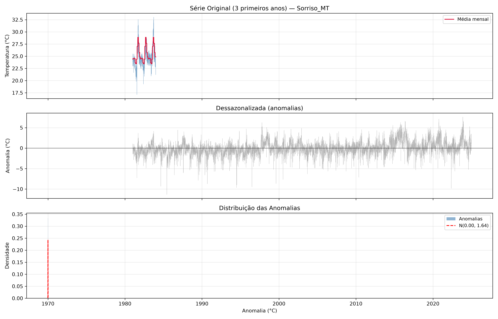
  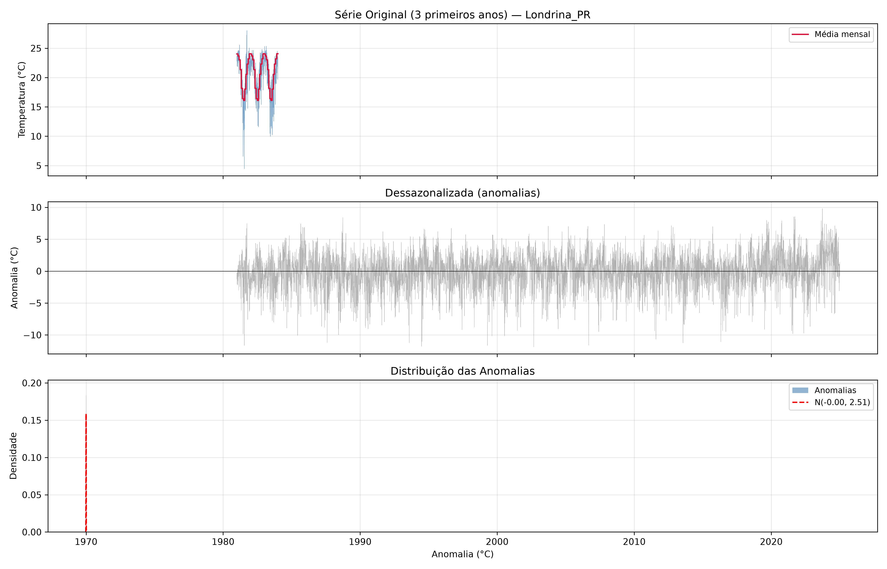
  <br>
  
  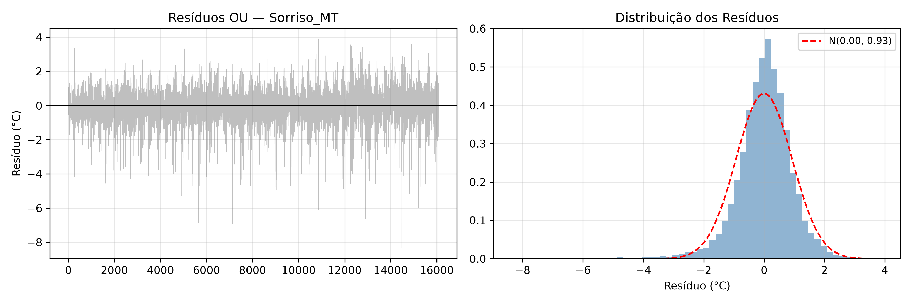
  <br>
  <em>Processo OU calibrado e resíduos para as 3 regiões</em>
</p>

| Região | θ (rev.) | σ (vol.) | Meia-vida | R² OU |
|--------|----------|---------|-----------|-------|
| Sorriso/MT | 0,192 | 1,02 | 3,6 dias | 0,68 |
| Londrina/PR | 0,214 | 1,64 | 3,2 dias | 0,65 |
| Rio Verde/GO | 0,197 | 1,21 | 3,5 dias | 0,67 |

### CDD e Perda de Produtividade

**CDD** = Σ max(0, T_média - 25 °C) em DEZ-FEV

Perda = min(max(0, γ · (CDD - K_prod)), perda_máxima)

<p align="center">
  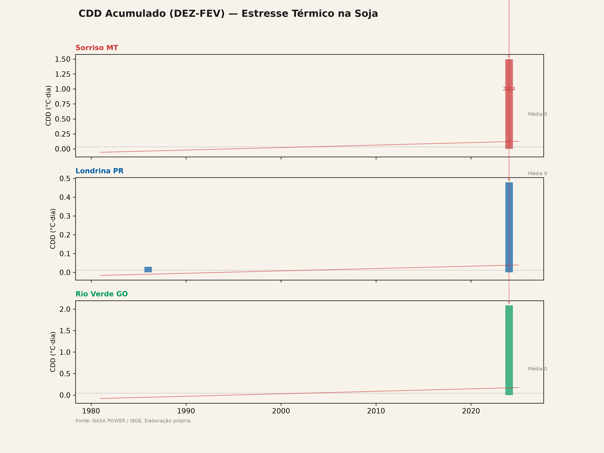
  <br>
  <em>CDD acumulado em DEZ-FEV (1980–2025) — 3 regiões</em>
</p>

<p align="center">
  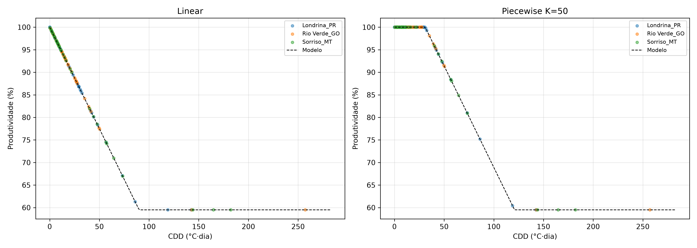
  <br>
  <em>Relação CDD × produtividade da soja com ajuste linear</em>
</p>

<p align="center">
  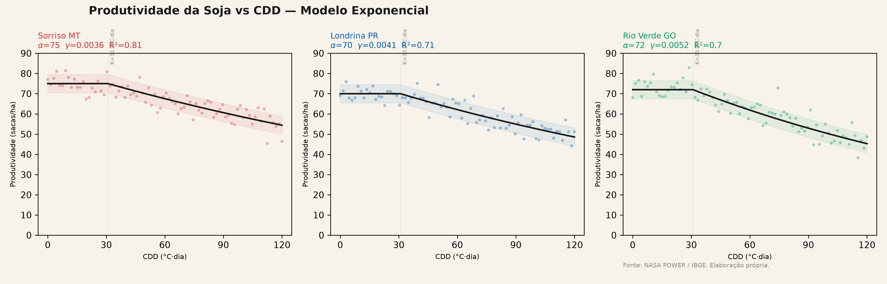
  <br>
  <em>Calibração da função perda de produtividade</em>
</p>

| Região | γ | K (°C·dia) | perda_máx | R² |
|--------|---|------------|-----------|----|
| Sorriso/MT | 0,0036 | 30,9 | 40,5% | **0,81** |
| Londrina/PR | 0,0045 | 33,6 | 36,1% | 0,70 |
| Rio Verde/GO | 0,0052 | 27,7 | 44,7% | 0,75 |

### Backtest Walk-Forward

Para cada safra de 1985 a 2024 (40 safras):

1. Recalibra OU com janela expansiva de todos os anos anteriores
2. Precifica opção CDD via Monte Carlo (20k trajetórias)
3. Testa hedge contra CDD real observado naquela safra
4. Calcula: prêmio pago, payoff recebido, receita física vs hedgeada

<p align="center">
  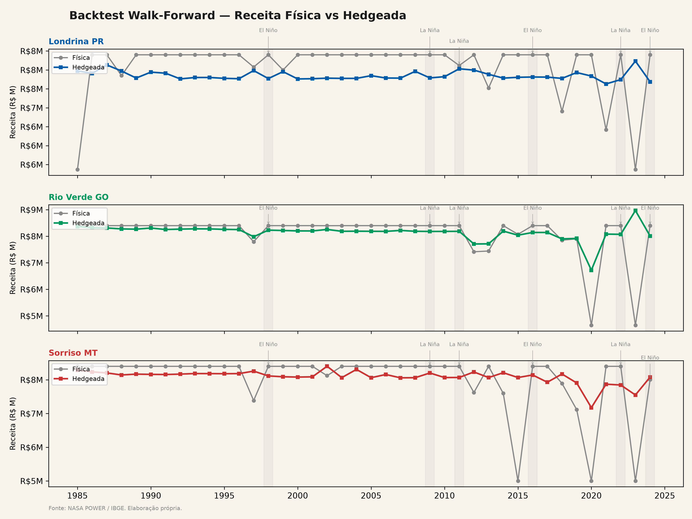
  <br>
  <em>Série temporal: receita física vs receita hedgeada — cada ponto é uma safra</em>
</p>

<p align="center">
  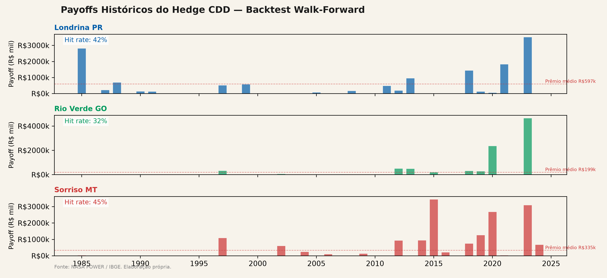
  <br>
  <em>Payoffs históricos das opções CDD — prêmio pago vs indenização recebida</em>
</p>

**Resultados do backtest vs Monte Carlo prospectivo:**

| Região | Efetiv. BT | Efetiv. MC | Diferença | Hit Rate |
|--------|-----------|-----------|-----------|----------|
| Londrina/PR | **84,3%** | 86,1% | -1,9% | 42,5% |
| Sorriso/MT | **77,6%** | 83,1% | -5,5% | 45,0% |
| Rio Verde/GO | **64,2%** | 65,1% | -0,9% | 32,5% |

O backtest confirma as conclusões do Monte Carlo: MT e PR com efetividade
sólida, GO requer hedge complementar.

### Precificação: Monte Carlo

Opção CDD precificada via Monte Carlo com 20.000–50.000 trajetórias e
discretização exata do processo OU.

<p align="center">
  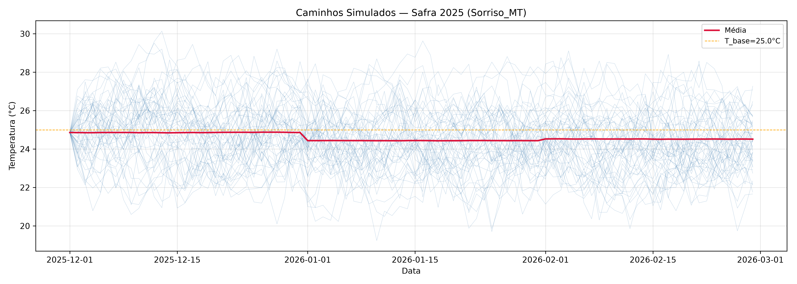
  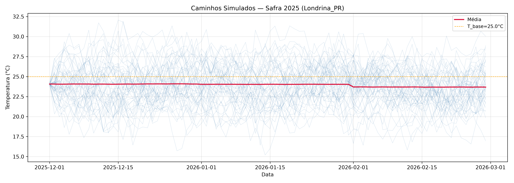
  <br>
  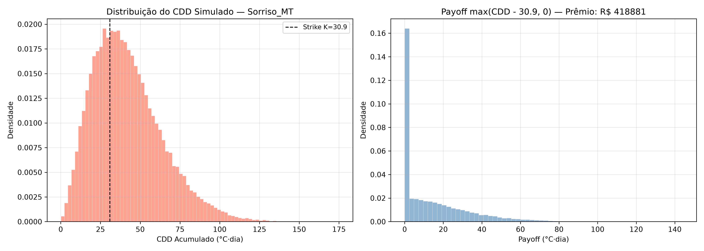
  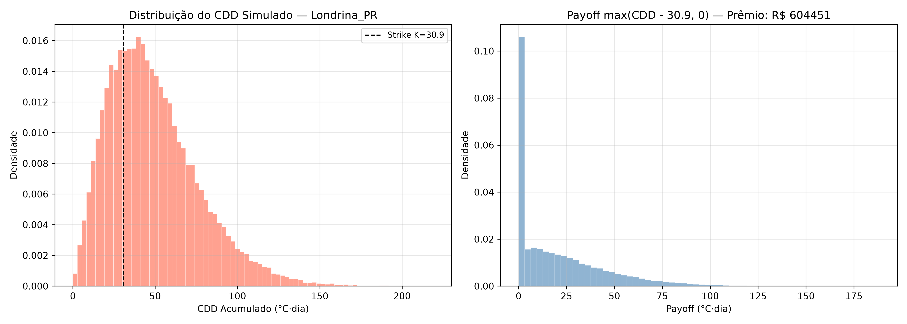
  <br>
  <em>Trajetórias Monte Carlo (esq.) e distribuição dos payoffs (dir.)</em>
</p>

### Tese de Investimento

<p align="center">
  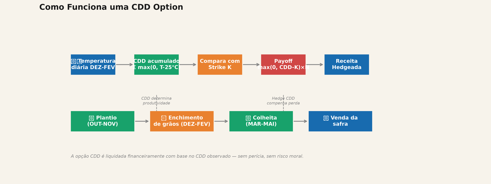
  <br>
  <em>Fluxo conceitual de uma operação de hedge com CDD option</em>
</p>

<p align="center">
  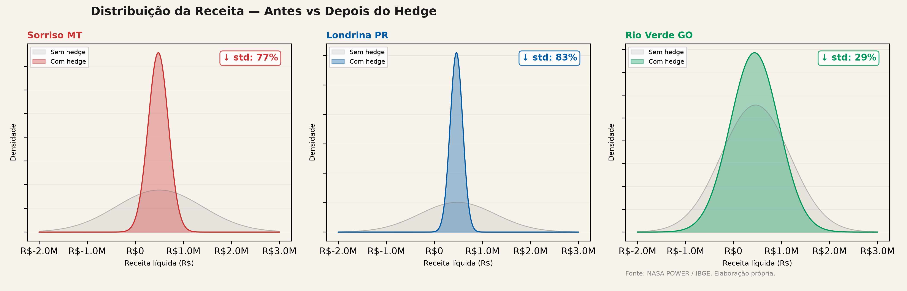
  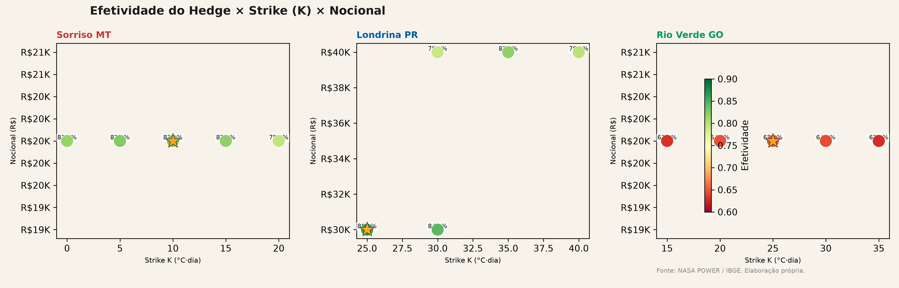
  <br>
  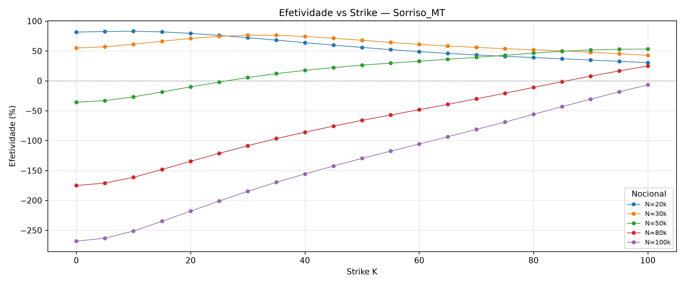
  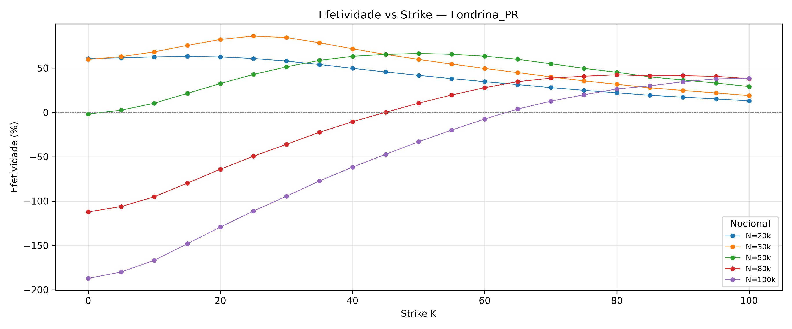
  <br>
  <em>Distribuição do hedge, análise de sensibilidade e curvas de efetividade</em>
</p>

<p align="center">
  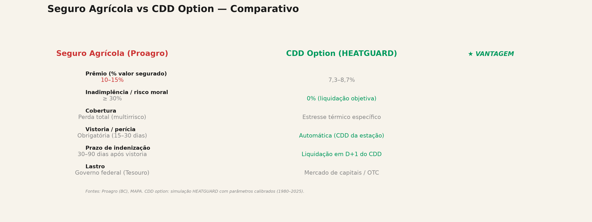
  <br>
  <em>Comparativo: prêmio de CDD option vs seguro agrícola tradicional</em>
</p>

1. **Sorriso/MT — RECOMENDADO:** R² mais alto (0,81), γ mais baixo (0,0036).
   Efetividade backtest de 77,6%. Estruturável como produto OTC.

2. **Londrina/PR — RECOMENDADO:** Maior efetividade (84,3% BT, 86,1% MC).
   Prêmio mais alto (8,7%) justificado pela maior volatilidade (σ = 1,64).

3. **Rio Verde/GO — CAUTELA:** Efetividade marginal (64,2%). γ alto (0,0052)
   indica perda abrupta por CDD. Necessário hedge complementar.

---

## Dados

- **Fonte:** [NASA POWER](https://power.larc.nasa.gov/) — grade 0,5°×0,5°
- **Período:** 1980–2025 (46 safras)
- **Período crítico:** Dezembro–Fevereiro (DEZ-FEV)
- **Cache local:** `data/raw/nasa_power_raw.parquet`

| Região | Latitude | Longitude | Estado |
|--------|----------|-----------|--------|
| Sorriso | 12,55°S | 55,71°O | MT |
| Londrina | 23,31°S | 51,16°O | PR |
| Rio Verde | 17,80°S | 50,93°O | GO |

---

## Identidade Visual — HEATGUARD

- **Logo:** Termômetro (laranja) + espiga de soja (verde) sobre fundo bege
- **Paleta:** Azul Hedge (#003057), Verde Soja (#2E8B57), Laranja Alerta (#E8751A)
- **Tagline:** "Protegendo a safra brasileira do estresse térmico"
- Gerado por `python scripts/gerar_logo.py`

<p align="center">
  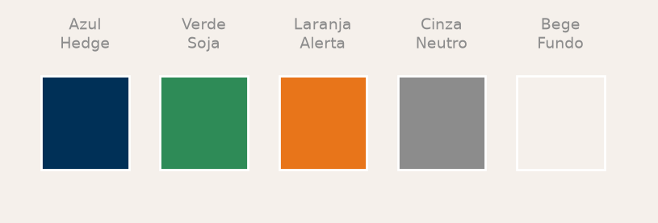
  <br>
  <em>Paleta de cores HEATGUARD</em>
</p>

---

## Licença

Projeto acadêmico — Desafio Quant AI. Dados NASA POWER de uso livre mediante
atribuição.
